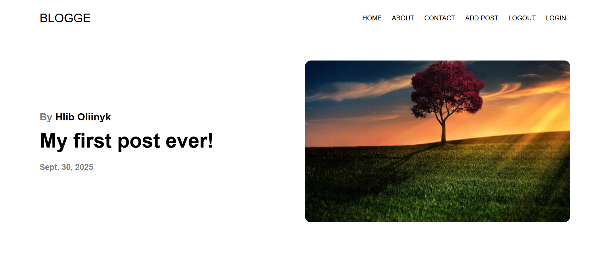
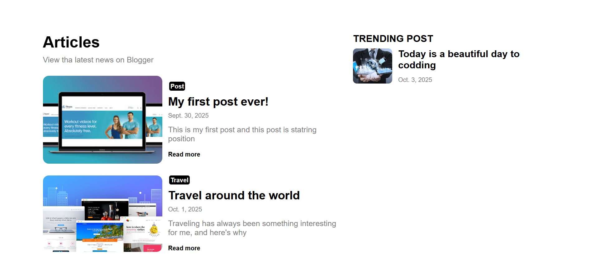

# BLOGGE---Django-Blog-Project
django, blog, rest-api, python, web-development

## Description

BLOGGE is a modern blog platform built with Django. It lets users create, edit, and view blog posts in a convenient interface. The project features classic blog functionality: post listing, individual post pages, creation and editing operations, and informative “About” and “Contact” pages. It supports uploading images to posts and provides a REST API for integration purposes.

## Features

- View a list of posts and individual post details
- Create, edit, and delete posts
- “About” and “Contact” informational pages
- Banner/image upload for posts
- REST API access to blog resources
- User authentication using Django Auth

## Installation

1. Clone the repository:
git clone https://github.com/your-username/blogge.git
cd blogge

2. Create and activate a virtual environment:
python -m venv venv
source venv/bin/activate # macOS/Linux
venv\Scripts\activate # Windows

3. Install dependencies:
pip install -r requirements.txt

4. Apply migrations:
python manage.py migrate

5. Create a superuser:
python manage.py createsuperuser

6. Start the development server:
python manage.py runserver


## Usage

- Home: `/` – list of posts
- View post: `/post/<id>`
- Create post: `/create`
- Edit post: `/post/<id>/update`
- About: `/about`
- Contact: `/contact`
- REST API: `/api/` – access blog data programmatically.

## Technologies

- Python
- Django 5.2
- Django REST Framework
- SQLite3 (default)
- HTML, CSS

## Example Model Structure

```python
class Post(models.Model):
    title = models.CharField('Name', max_length=40)
    content = models.TextField('Content', null=True)
    date = models.DateField('Date', null=True)
    topic = models.CharField('Topic', null=True)
    short_info = models.CharField('ShortInfo', null=True)
    banner = models.ImageField(default='photo_test.jpg', blank=True)

    def __str__(self):
        return self.title
```

## Screenshots

Here is a screenshot of the main menu of the BLOGGE project:




